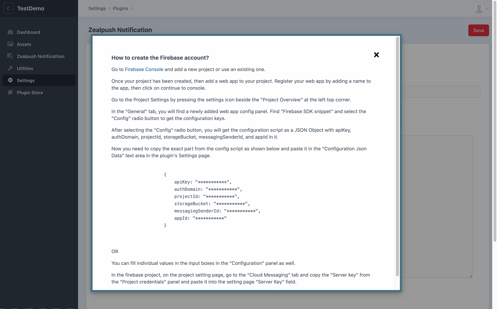
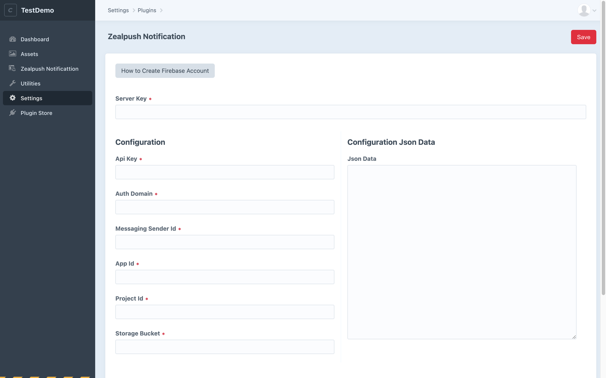
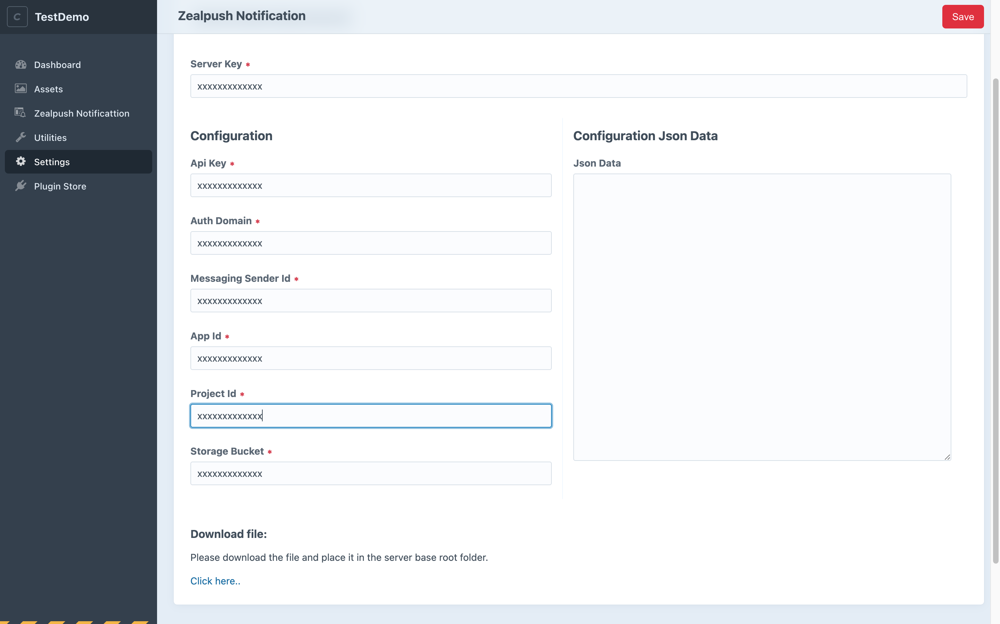
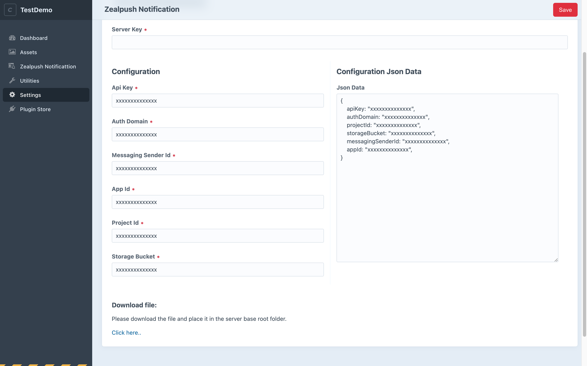
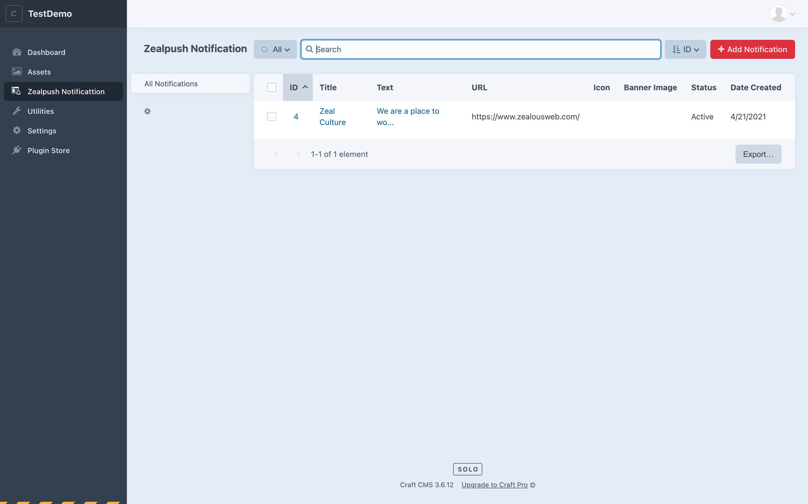
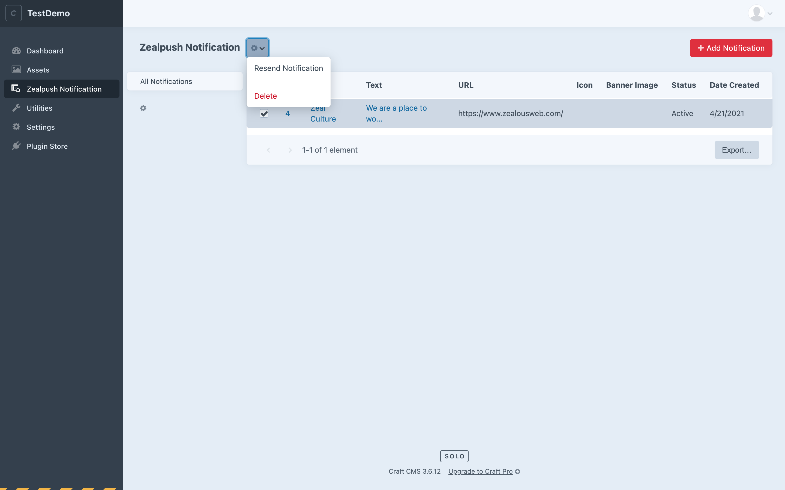
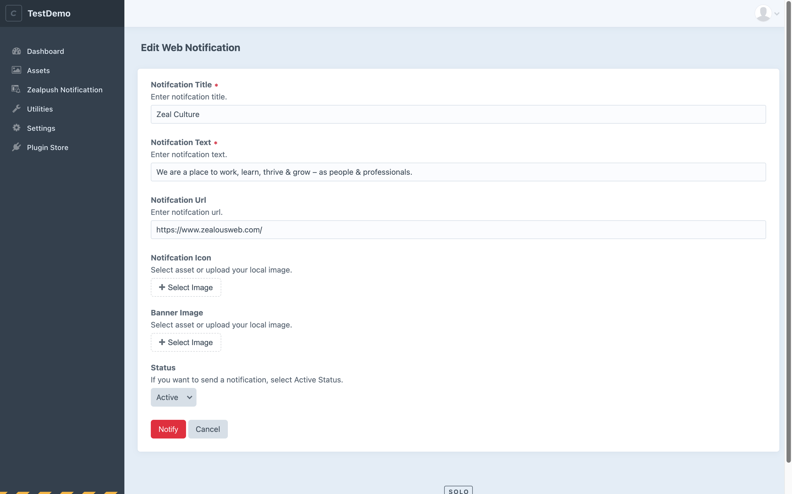

# Zealpush Notification For Craft CMS

This plugin is used to configure and display desktop notifications to the user. These notifications' appearance and specific functionality provide a way to provide information to the user asynchronously.

## Requirements:
The prerequisites for the Zealpush Notification Plugin to function are: 

1. Craft CMS  Version 3.1 or greater
2. PHP Version 7.2.5 or greater

## Installation:
You can install this plugin either from the [Plugin Store](https://plugins.craftcms.com/) or with Composer.

- **From the Plugin Store (Without Composer):**

	Go to the Plugin Store in your project’s Control Panel and search for ***“Zealpush Notification”*** Then click on the “Install” button in its modal window.
    
- **With Composer:**

```bash
# go to the project directory
cd /path/to/my-project

# Command the composer to load the plugin
composer require zealouswebcraftcms/zealpush-notification

# Command the craft to install the plugin
./craft install/plugin zealpush-notification
```

## Major features of the Plugin:
- Create a notification or edit the existing ones.
- Option to send an icon and an image with a notification.
- Store notification for future use.
- Option to resend existing notifications.
- Remove unnecessary or old notifications.
- Add notifications for future use using Inactive status.






















## General Settings:
#### **How to create a firebase account:** 
- To create the Firebase account:
- Go to [Firebase Console](https://console.firebase.google.com/u/0/) and add a new project or use an existing one.
- Once your project has been created, then add a web app to your project. Register your web app by adding a name to the app, then click on continue to console.
- Go to the Project Settings by pressing the settings icon beside the "Project Overview" at the left top corner.
- In the "General" tab, you will find a newly added web app config panel. Find "Firebase SDK snippet" and select the "Config" radio button to get the configuration keys.
- After selecting the "Config" radio button, you will get the configuration script as a JSON Object with apiKey, authDomain, projectId, storageBucket, messagingSenderId, and appId in it.
- Now you need to copy the exact part from the config script as shown below and paste it in the "Configuration Json Data" text area in the plugin's Settings page.

```twig
	{
		apiKey: "***********",
		authDomain: "***********",
		projectId: "***********",
		storageBucket: "***********",
		messagingSenderId: "***********",
		appId: "***********"
	}
```
- OR 
- You can fill individual values in the input boxes in the "Configuration" panel as well.
- In the firebase project, on the project setting page, go to the "Cloud Messaging" tab and copy the "Server key" from the "Project credentials" panel and paste it into the setting page "Server Key" field.

## Usage:
After adding the required information on the settings page, download the js file and place it in the server base root folder.

Put the below one-line code on your front home page.

```twig

```

While accessing your site, users will get a popup to enable the option for getting the notifications in the future.

## Notification:
#### **Add/Edit Notifications:**
- Option to add notification in title, text, URL, icon, image, and status according to your requirement.
- You can choose an image on your assets or local.
- If you select Active status, a notification will be sent to your user. The Inactive status notification is stored in your system. Later on, you can edit any notification.

#### **Notification List:**
- On the list page, you can sort, filter data for particular fields.

#### **Delete Notifications:**
- On the list page, there is an option to select one or more notifications and delete them.

#### **Resend Notifications:**
- You can resend one or more notifications from the listing page at a time.